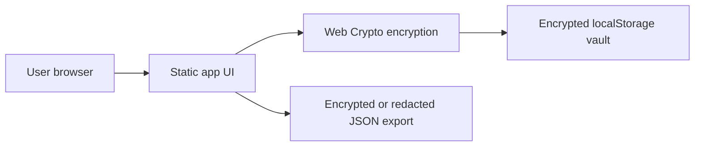

# Architecture

## Overview

API Key Vault Manager is intentionally small: static HTML, CSS, and JavaScript modules with no backend service. That keeps hosting simple and makes it suitable for GitHub Pages.



## Runtime Pieces

- `index.html` loads the app and sets a restrictive Content Security Policy.
- `src/app.js` owns application state, rendering, forms, filtering, audit events, import/export, auto-lock, copy, and reveal behavior.
- `src/schema.js` defines the metadata model and validation rules.
- `src/standards.js` defines ISO-aligned implementation controls, standards references, evidence status, and redaction behavior.
- `src/vaultCrypto.js` wraps Web Crypto AES-GCM encryption and PBKDF2 key derivation.
- `src/sampleData.js` gives safe placeholder records to help new users understand the shape of the vault.

## Vault Format

The encrypted browser record looks like:

```json
{
  "version": 1,
  "createdAt": "2026-05-06T00:00:00.000Z",
  "crypto": {
    "algorithm": "AES-GCM",
    "kdf": "PBKDF2",
    "hash": "SHA-256",
    "iterations": 600000,
    "salt": "base64",
    "iv": "base64"
  },
  "payload": "base64 ciphertext"
}
```

The decrypted payload contains settings, entries, and audit events. It should never be committed to GitHub.

## Hosting

The app can be hosted as static files on GitHub Pages. The included Pages workflow uploads the repository contents as a static artifact.
